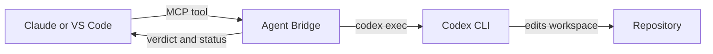

# Agent Bridge

Agent Bridge lets Claude Code, Claude Desktop, Codex and VS Code ask another
local coding agent for help. Its main workflow is Claude delegating a defined
implementation task to Codex, then receiving a short result, a verification
verdict and the repository status.



The bridge launches CLIs already installed and authenticated on your computer.
It does not send API requests itself, share credentials, connect two existing
chat windows, or copy the caller's full conversation. Every delegation must be
self-contained. A project context file and named Codex lanes reduce repetition
across related tasks.

## Requirements

- Node.js 18 or newer.
- OpenAI Codex CLI installed and signed in with `codex login`.
- Claude Code installed and signed in if you want Codex or VS Code to use
  `ask_claude`.
- A Git repository is strongly recommended so the bridge can report the working
  tree before and after delegated work.

## Install

### Claude Desktop

1. Download `agent-bridge-0.9.3.mcpb` from Releases.
2. Double-click it, or drag it into **Settings > Extensions**.
3. Set **Default project folder** if requests will not always include an
   absolute `cwd`.
4. Confirm that the Agent Bridge tools appear in Claude.

Claude Desktop is then able to ask Codex questions and delegate tasks through
the local Codex CLI.

### VS Code, Claude Code and Codex CLI

1. In VS Code, open **Extensions > ... > Install from VSIX**.
2. Select `agent-bridge-0.9.3.vsix`.
3. Accept the one-time offer to enable the bridge for the Codex and Claude Code
   CLIs. You can run **Agent Bridge: Enable for Codex and Claude Code** later if
   you initially decline.
4. Reload existing CLI sessions so they discover the new MCP server.

The extension copies the server to `~/.agent-bridge/agent-bridge.mjs`, registers
that stable path with both CLIs, and stores its non-secret settings beside it.
Extension updates refresh the stable server copy. Use **Agent Bridge: Remove
from Codex and Claude Code** to remove both registrations and Claude's delegation
skill.

## Tools

| Tool | Purpose | Can write locally |
| --- | --- | --- |
| `ask_codex` | Get a Codex review or second opinion | No |
| `delegate_to_codex` | Give Codex one complete implementation task | Yes |
| `start_codex_jobs` | Queue independent or overlapping Codex builds | Yes |
| `collect_codex_jobs` | Wait for and collect background results | No additional writes |
| `set_project_context` | Save reusable repository context | Yes |
| `ask_claude` | Get a read-only Claude Code review | No |

`ask_codex` runs with Codex's `read-only` sandbox. Local delegation uses
`workspace-write`. `ask_claude` exposes only Claude's `Read`, `Grep` and `Glob`
built-in tools and blocks MCP tools for that child run.

## Recommended cooperation workflow

Start once per repository by asking Claude to call `set_project_context` with
the architecture, conventions, important interfaces and areas that must not be
changed. This writes `.agent-bridge/context.md`. Commit it if the whole team
should share the same handoff context.

For each implementation, give Claude a request such as:

```text
Use Agent Bridge to delegate this implementation to Codex.
Task: Add validation to the order creation endpoint using the existing validator pattern.
Files: src/Orders, tests/Orders
Constraints: no new dependencies; preserve the public response schema.
Done when: invalid quantities return 400 and existing valid requests still pass.
Verify: dotnet test tests/Orders.Tests
Lane: order-validation
```

Use the same `lane` for follow-up work in that repository. Agent Bridge reads the
session ID from Codex's documented JSONL stream and scopes it to the absolute
repository path, so an identical lane name in another repository stays separate.

Use `start_codex_jobs` for multiple tasks. List exact files or directories,
separated by commas, new lines or spaces; quote a path that contains a space. Tasks whose paths overlap are queued across
separate calls; independent tasks run concurrently. Omitting `files`, or using a
glob, safely treats the task as touching the entire workspace.

After Codex finishes, the response shows verification first, then `git status
--short` for the working tree and any entries already present before delegation.
The status includes untracked files. A passing command proves only what that
command checks, so Claude should still inspect sensitive or surprising changes.

## Effort and models

Every agent tool accepts `fast`, `balanced` or `deep`. Configure their model
mapping in `~/.agent-bridge/models.json`:

```json
{
  "codex": {
    "fast": "",
    "balanced": "",
    "deep": ""
  },
  "claude": {
    "fast": "",
    "balanced": "",
    "deep": ""
  },
  "codexReasoning": {
    "fast": "low",
    "balanced": "medium",
    "deep": "high"
  }
}
```

An empty model value lets that CLI use its configured default.

## Conserve mode

Conserve mode changes the MCP tool descriptions so Claude treats delegating
settled implementation work as its normal choice. It is a manual switch. MCP
does not expose Claude's remaining usage to the bridge.

Toggle it from the Agent Bridge status item or command palette in VS Code. In an
MCPB installation, set **Conserve mode** to `1`.

## Remote HTTP mode

HTTP mode is optional and intended for a separately secured tunnel when a phone
cannot launch the local server. The server binds to `127.0.0.1` by default and
requires a random secret of at least 24 characters in the URL path.

Remote writes are disabled by default. In that state Codex runs read-only,
verification commands do not run, and `set_project_context` is unavailable.
Setting `AGENT_BRIDGE_REMOTE_WRITES=1` grants remote callers the same local write
capabilities as a desktop caller. Treat the URL as a credential and put the
tunnel behind its own authentication.

## Failure behavior

- A non-zero CLI exit is returned as an error even if the CLI printed a partial
  answer.
- After two failures from one peer in a server session, the circuit breaker
  stops invoking it repeatedly.
- Timeouts, MCP cancellation and host shutdown terminate the full spawned
  process tree, including verification commands.
- Verification commands are split into executable and arguments, never passed
  as a shell string. The first executable must be in
  `AGENT_BRIDGE_VERIFY_ALLOW`.
- Background work exists only for the lifetime of the MCP server. Closing its
  host cancels queued and running jobs.

## Settings reference

Most people never need these. The extension and the MCPB install screen set the
first four for you.

| Variable | Default | Purpose |
| --- | --- | --- |
| `AGENT_BRIDGE_DEFAULT_CWD` | unset | Folder used when a request does not name one |
| `AGENT_BRIDGE_CONSERVE` | unset | `1` turns on conserve mode |
| `AGENT_BRIDGE_CODEX_BIN` | `codex` | Full path if it is not on PATH |
| `AGENT_BRIDGE_CLAUDE_BIN` | `claude` | Full path if it is not on PATH |
| `AGENT_BRIDGE_TIMEOUT_MS` | `300000` | Timeout for `ask_` tools |
| `AGENT_BRIDGE_DELEGATE_TIMEOUT_MS` | `1800000` | Timeout for delegations and jobs |
| `AGENT_BRIDGE_MAX_REPLY_CHARS` | `6000` | Trim a long peer reply before it reaches the caller |
| `AGENT_BRIDGE_MAX_STATUS_LINES` | `40` | Cap on working-tree entries listed per delegation |
| `AGENT_BRIDGE_MAX_FAILURES` | `2` | Failures of one peer before the breaker opens |
| `AGENT_BRIDGE_CONTEXT_MAX` | `8000` | Cap on the injected project context |
| `AGENT_BRIDGE_VERIFY_ALLOW` | test runners | Commands `verify` may run, matched on the first token |
| `AGENT_BRIDGE_CODEX_MODEL` | unset | Blanket Codex model for bridged calls |
| `AGENT_BRIDGE_CLAUDE_MODEL` | unset | Blanket Claude model for bridged calls |
| `AGENT_BRIDGE_CODEX_APPROVAL` | `never` | Codex approval policy; empty omits the flag |
| `AGENT_BRIDGE_CODEX_STDIN` | unset | `0` passes the prompt as an argument instead of stdin |
| `AGENT_BRIDGE_CODEX_RESUME` | unset | `0` disables lanes if your Codex has no `exec resume` |
| `AGENT_BRIDGE_REMOTE_SECRET` | unset | Required for `--http`; 24 characters or more |
| `AGENT_BRIDGE_HTTP_PORT` | `7333` | Port for HTTP mode |
| `AGENT_BRIDGE_HTTP_HOST` | `127.0.0.1` | Interface for HTTP mode; leave it on loopback |
| `AGENT_BRIDGE_REMOTE_WRITES` | unset | `1` gives remote callers local write capability |

## Checking your setup

```text
npm run doctor
```

The test suite uses stub CLIs, so it cannot tell whether the real Codex and
Claude Code accept the flags the bridge passes. `doctor` checks each one against
the installed CLIs and makes one live read-only Codex call. Run it after
installing and after either CLI updates. `--no-live` skips the live call.

The check that matters most is `claude --tools`. `--allowedTools` only skips
permission prompts and appends to the default tool set, so if `--tools` ever
disappears, `ask_claude` stops being read-only while still looking like it is.

## Development

```text
npm run check    syntax-check both JavaScript entry points
npm test         run protocol and process integration tests with stub CLIs
npm run build    produce the MCPB and VSIX in dist/
npm run doctor   check the installed CLIs accept the flags the bridge uses
```

`src/agent-bridge.mjs` is the server source. The build copies it into both
packages. See `CLAUDE.md` for maintenance constraints and
`CLAUDE_HANDOFF.md` for the 0.9.1 review-to-fix record.

## Limits

- Delegation reaches the local Codex CLI, using its configured account and
  model. It is not an API for controlling an open ChatGPT conversation.
- The caller's chat history is not transferred automatically.
- Direct, simultaneous `delegate_to_codex` calls can still target the same file.
  Use `start_codex_jobs` when coordinating more than one build.
- Git status describes the complete working tree. Pre-existing entries are
  labelled, but edits to an already dirty file cannot be attributed perfectly.
- Claude's remaining usage is unavailable. Codex usage is best-effort status
  information from Codex's app server, with session logs as a fallback.

## Licence

MIT.
