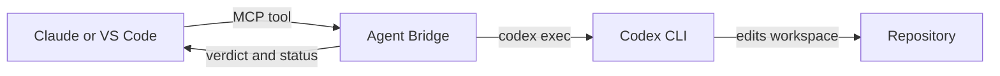

# Agent Bridge

Agent Bridge lets Claude Code, Claude Desktop, Codex and VS Code ask another
local coding agent for help. Its main workflow is Claude delegating a defined
implementation task to Codex, then receiving a short result, a verification
verdict and the repository status.



The bridge launches CLIs already installed and authenticated on your computer.
It does not send API requests itself, share credentials, connect two existing
chat windows, or copy the caller's full conversation. Every delegation must be
self-contained. A project context file and named Codex lanes reduce repetition
across related tasks.

## Requirements

- Node.js 18 or newer.
- OpenAI Codex CLI installed and signed in with `codex login`.
- Claude Code 2.1.248 or newer, installed and signed in, if you want Codex or
  VS Code to use `ask_claude`. That version introduced restricted mode.
- A Git repository is strongly recommended so the bridge can report the working
  tree before and after delegated work.

## Install

### Claude Desktop

1. Download `agent-bridge-0.9.9.mcpb` from Releases.
2. Double-click it, or drag it into **Settings > Extensions**.
3. Set **Default project folder** if requests will not always include an
   absolute `cwd`.
4. Confirm that the Agent Bridge tools appear in Claude.

Claude Desktop is then able to ask Codex questions and delegate tasks through
the local Codex CLI.

### VS Code, Claude Code and Codex CLI

1. In VS Code, open **Extensions > ... > Install from VSIX**.
2. Select `agent-bridge-0.9.9.vsix`.
3. Accept the one-time offer to enable the bridge for the Codex and Claude Code
   CLIs. You can run **Agent Bridge: Enable for Codex and Claude Code** later if
   you initially decline.
4. Reload existing CLI sessions so they discover the new MCP server.

The extension copies the server to `~/.agent-bridge/agent-bridge.mjs`, registers
that stable path with both CLIs, and stores its non-secret settings beside it.
Extension updates refresh the stable server copy. Use **Agent Bridge: Remove
from Codex and Claude Code** to remove both registrations and Claude's delegation
skill.

## Tools

| Tool | Purpose | Can write locally |
| --- | --- | --- |
| `ask_codex` | Get a Codex review or second opinion | No |
| `delegate_to_codex` | Give Codex one complete implementation task | Yes |
| `start_codex_jobs` | Queue independent or overlapping Codex builds | Yes |
| `collect_codex_jobs` | Wait for and collect background results | No additional writes |
| `set_project_context` | Save reusable repository context | Yes |
| `ask_claude` | Get a read-only Claude Code review | No |

`ask_codex` runs with Codex's `read-only` sandbox, ephemeral sessions, and ignored
user config/execpolicy rules. Select its model through Agent Bridge rather than
Codex user config. These layers are not a universal sandbox for external tools
or an override of managed policy; use trusted CLI installations and review any
remaining project/managed configuration. Local delegation uses `workspace-write` and retains the
project's normal Codex configuration.

`ask_claude` combines Claude Code's restricted and bare modes, attempts to disable
session persistence, exposes only `Read`, `Grep` and `Glob`, and blocks MCP tools. This
confines reads to the working directories and skips user/project hooks, skills,
plugins, memory and MCP configuration for that child run.

If its CLI parser rejects `--no-session-persistence`, one retry omits only that
flag and reports the change. The CLI may then retain the question and answer in
local session files. Read-only refers to the delegated workspace behavior, not
zero local metadata writes; the bridge itself also maintains status and lanes.
Required safety flags are never dropped. Managed policy remains authoritative.

## Recommended cooperation workflow

Start once per repository by asking Claude to call `set_project_context` with
the architecture, conventions, important interfaces and areas that must not be
changed. This writes `.agent-bridge/context.md`. Commit it if the whole team
should share the same handoff context.

For each implementation, give Claude a request such as:

```text
Use Agent Bridge to delegate this implementation to Codex.
Task: Add validation to the order creation endpoint using the existing validator pattern.
Files: src/Orders, tests/Orders
Constraints: no new dependencies; preserve the public response schema.
Done when: invalid quantities return 400 and existing valid requests still pass.
Verify: dotnet test tests/Orders.Tests
Lane: order-validation
```

Use the same `lane` for follow-up work in that repository. Agent Bridge reads the
session ID from Codex's documented JSONL stream and scopes it to the absolute
repository path, so an identical lane name in another repository stays separate.

Use `start_codex_jobs` for multiple tasks. List exact files or directories,
separated by commas, new lines or spaces; quote a path that contains a space.
Tasks whose paths overlap are queued across separate calls; independent tasks
run concurrently up to the configured limit (four by default). Tasks sharing a
lane are always serialized so they cannot race the same saved Codex thread.
Omitting `files`, or using a glob, safely treats the task as touching the entire
workspace. Claims coordinate background jobs inside one bridge process; they do
not restrict what Codex can edit and they are not a cross-process file lock.

After Codex finishes, the response shows verification first, then bounded
working-tree observations. The bridge uses Git porcelain output plus file
fingerprints, so it detects new entries, another edit to an already-dirty file,
and a dirty entry that became clean. Untracked files are included and unchanged
pre-existing entries are counted instead of repeated. The report says
"observed during" rather than attributing concurrent repository activity to one
process. A passing command proves only what that command checks, so Claude
should still inspect sensitive or surprising changes.

## Effort and models

Every agent tool accepts `fast`, `balanced` or `deep`. Configure their model
mapping in `~/.agent-bridge/models.json`:

```json
{
  "codex": {
    "fast": "",
    "balanced": "",
    "deep": ""
  },
  "claude": {
    "fast": "",
    "balanced": "",
    "deep": ""
  },
  "codexReasoning": {
    "fast": "low",
    "balanced": "medium",
    "deep": "high"
  }
}
```

An empty model value lets that CLI use its configured default.

## Conserve mode

Conserve mode changes the MCP tool descriptions so Claude treats delegating
settled implementation work as its normal choice. It is a manual switch. MCP
does not expose Claude's remaining usage to the bridge.

Toggle it from the Agent Bridge status item or command palette in VS Code. In an
MCPB installation, set **Conserve mode** to `1`.

## Remote HTTP mode

HTTP mode is optional and intended for a separately secured tunnel when a phone
cannot launch the local server. The server binds to `127.0.0.1` by default and
requires a random secret of at least 24 characters in the URL path.

Remote writes are disabled by default. In that state Codex runs read-only,
verification commands do not run, and `set_project_context` is unavailable.
Setting `AGENT_BRIDGE_REMOTE_WRITES=1` grants remote callers the same local write
capabilities as a desktop caller. Even read-only mode lets a caller ask the local
agents to inspect files under a supplied `cwd`, so treat the URL as a credential
and put the tunnel behind its own authentication.

The endpoint validates `Origin` to prevent browser DNS rebinding. Requests with
no `Origin` (normal server-to-server connectors) are accepted. If a browser or
tunnel sends one, list its exact origin in the comma-separated
`AGENT_BRIDGE_HTTP_ALLOWED_ORIGINS`; every other origin is rejected. The bridge
never writes the secret path to its own diagnostics, but a reverse proxy may log
URLs, so configure its access logs accordingly.

HTTP and stdio accept legacy initialize-based MCP clients and the current
2026-07-28 per-request-metadata protocol. Modern HTTP calls validate the protocol,
method and tool-name headers against the JSON body. Closing an HTTP connection
cancels the peer process attached to that request.

This HTTP endpoint is stateless: cancellation uses the original connection's
closure, not an unrelated POST naming the same JSON-RPC ID. Background work
outlives its start/collect request until the MCP host shuts down. A cancelled
collection leaves its results available for another collection attempt.

## Failure behavior

- A non-zero CLI exit is returned as an error even if the CLI printed a partial
  answer.
- After two failures from one peer in a server session, the circuit breaker
  stops invoking it repeatedly.
- Timeouts, MCP cancellation and host shutdown terminate the full spawned
  process tree, including verification commands.
- Verification commands are split into executable and arguments, never passed
  as a shell string. The first executable must be in
  `AGENT_BRIDGE_VERIFY_ALLOW`; quoted paths are supported.
- The verification allowlist is not a security sandbox. Commands such as npm,
  npx and language runtimes can execute arbitrary repository code with your user
  privileges. Only verify repositories and commands you trust.
- Peer and verification output is bounded while the process runs, before the
  smaller final reply limit is applied.
- Codex JSONL is parsed incrementally. A failure event cannot be removed by
  output trimming; missing final answers and oversized events fail explicitly.
- A requested verification command that is blocked, malformed, missing or fails
  makes the delegation fail. After a failed/cancelled peer, verification does
  not run. Omitting `verify` remains allowed but is explicitly unverified.
- Git observations include verification side effects, resolve paths from the
  repository root, and include index hashes and modes using porcelain v2.
  They are observations between snapshots, not proof of who changed a file or
  detection of every intermediate edit/commit.
- Background work exists only for the lifetime of the MCP server. Closing its
  host cancels queued and running jobs.

## Settings reference

Most people never need these. The extension and the MCPB install screen set the
first four for you.

| Variable | Default | Purpose |
| --- | --- | --- |
| `AGENT_BRIDGE_DEFAULT_CWD` | unset | Folder used when a request does not name one |
| `AGENT_BRIDGE_CONSERVE` | unset | `1` turns on conserve mode |
| `AGENT_BRIDGE_CODEX_BIN` | `codex` | Full path if it is not on PATH |
| `AGENT_BRIDGE_CLAUDE_BIN` | `claude` | Full path if it is not on PATH |
| `AGENT_BRIDGE_TIMEOUT_MS` | `300000` | Timeout for `ask_` tools |
| `AGENT_BRIDGE_DELEGATE_TIMEOUT_MS` | `1800000` | Timeout for delegations and jobs |
| `AGENT_BRIDGE_MAX_REPLY_CHARS` | `6000` | Trim a long peer reply before it reaches the caller |
| `AGENT_BRIDGE_MAX_PROCESS_OUTPUT_CHARS` | `1000000` | Per-buffer capture bound and maximum Codex JSONL event size |
| `AGENT_BRIDGE_MAX_STATUS_LINES` | `40` | Cap on working-tree entries listed per delegation |
| `AGENT_BRIDGE_MAX_FAILURES` | `2` | Failures of one peer before the breaker opens |
| `AGENT_BRIDGE_CONTEXT_MAX` | `8000` | Cap on the injected project context |
| `AGENT_BRIDGE_VERIFY_ALLOW` | test runners | Commands `verify` may run, matched on the first token |
| `AGENT_BRIDGE_MAX_CONCURRENT_JOBS` | `4` | Maximum Codex background processes at once (hard cap 32) |
| `AGENT_BRIDGE_MAX_JOBS_PER_CALL` | `8` | Maximum tasks accepted by one start call (hard cap 64) |
| `AGENT_BRIDGE_MAX_OUTSTANDING_JOBS` | `64` | Running, queued or completed jobs awaiting collection (hard cap 512) |
| `AGENT_BRIDGE_CODEX_MODEL` | unset | Blanket Codex model for bridged calls |
| `AGENT_BRIDGE_CLAUDE_MODEL` | unset | Blanket Claude model for bridged calls |
| `AGENT_BRIDGE_CODEX_APPROVAL` | `never` | Codex approval policy; empty omits the flag |
| `AGENT_BRIDGE_CODEX_STDIN` | unset | `0` passes the prompt as an argument instead of stdin |
| `AGENT_BRIDGE_CODEX_RESUME` | unset | `0` disables lanes if your Codex has no `exec resume` |
| `AGENT_BRIDGE_HTTP` | unset | `1` enables HTTP mode without passing `--http` |
| `AGENT_BRIDGE_REMOTE_SECRET` | unset | Required for `--http`; 24 characters or more |
| `AGENT_BRIDGE_HTTP_PORT` | `7333` | Port for HTTP mode; `0` selects a free port for tests |
| `AGENT_BRIDGE_HTTP_HOST` | `127.0.0.1` | Interface for HTTP mode; leave it on loopback |
| `AGENT_BRIDGE_HTTP_ALLOWED_ORIGINS` | unset | Exact comma-separated browser origins; absent Origin remains allowed |
| `AGENT_BRIDGE_REMOTE_WRITES` | unset | `1` gives remote callers local write capability |

## Does it actually save anything

```text
npm run budget
```

Runs a realistic session against stub CLIs and reports the bytes that come back,
then compares that with doing the same work inline. Both sides are counted: the
delegated side pays for the files Claude still reads to design the handoff, the
handoff itself, the results, and the tool definitions that sit in every session.

On the default assumptions - six files read per task, 180 lines each, 120 lines
written - delegating five tasks consumes roughly 2.9x less of Claude's context
than doing them inline. This matters more than a single multiplier suggests,
because a coding agent re-sends the whole transcript every turn, so context spent
early is paid again on every later turn. That is the mechanism by which a session
lasts longer.

Adjust it to your repository:

```text
npm run budget -- --files 12 --lines 300 --written 400
```

Small tasks lose, and the tool says so rather than hiding it. Try
`--files 1 --lines 40 --written 15` and it reports that delegating costs more
than doing the work inline. The break-even is roughly one substantial delegation
per session; below that, the tool definitions cost more than they save.

What it does not measure: Codex's own quota, which is spent when work is
delegated but not when Claude does it inline. This is a Claude-context estimate,
not total spend across both providers, and it does not model provider caching or
exact API billing.

## Checking your setup

```text
npm run doctor
```

The test suite uses stub CLIs, so it cannot prove that installed CLIs accept the
real flags. `doctor` treats help output as advisory, then makes exact read-only
Codex and Claude calls, validates Codex JSONL/thread IDs, and probes the Codex
app-server rate-limit method. Run it after installing and after either CLI
updates. `--no-live` avoids authenticated agent calls and the app-server probe.
The Claude probe calls the actual bridge tool, including its optional-flag
fallback, rather than maintaining a separate copy of its CLI arguments.

Claude documents that `claude --help` does not show every supported flag, so a
missing help token is reported as skipped rather than as proof of failure. The
live exact-argument call is authoritative. Doctor does not perform a write-mode
delegation or a live lane resume; those remain installation smoke tests.

## Development

```text
npm run check    syntax-check both JavaScript entry points
npm test         run protocol and process integration tests with stub CLIs
npm run build    produce the MCPB and VSIX in dist/
npm run doctor   check the installed CLIs accept the flags the bridge uses
```

`src/agent-bridge.mjs` is the server source. The build copies it into both
packages. See `CLAUDE.md` for maintenance constraints and
`CLAUDE_HANDOFF.md` for the 0.9.1 review-to-fix record.

## Limits

- Delegation reaches the local Codex CLI, using its configured account and
  model. It is not an API for controlling an open ChatGPT conversation.
- Background scheduling and lane locks coordinate one Agent Bridge process.
  Separate MCP hosts can launch separate bridge processes and require normal
  repository/worktree isolation if they write concurrently.
- `files` is a scheduling declaration, not an edit permission boundary. Always
  inspect unexpected changes and keep sensitive work under source control.
- The caller's chat history is not transferred automatically.
- Direct, simultaneous `delegate_to_codex` calls can still target the same file.
  Use `start_codex_jobs` when coordinating more than one build.
- Git status describes the complete working tree. Pre-existing entries are
  labelled, but edits to an already dirty file cannot be attributed perfectly.
- Claude's remaining usage is unavailable. Codex usage is best-effort status
  information from Codex's app server, with session logs as a fallback.

## Licence

MIT.
